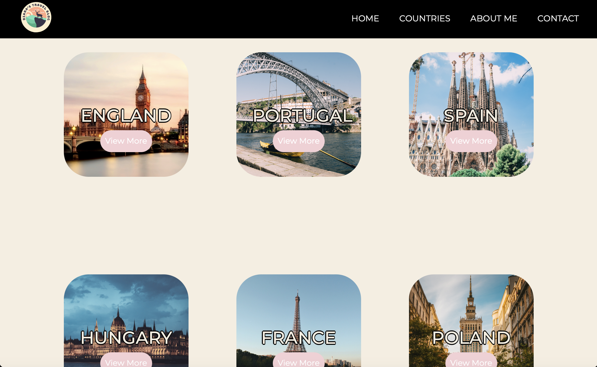

# My first ever website

    
    

I created this project back in 2022 as part of Harvard's Introduction to Computer Science Course. It's a small website where I documented some of my travels.

## Technologies Used
- HTML
- CSS
- Bootstrap

## Features
- Documentation of my travels
- Photo galleries from different destinations
- Interactive flip card with highlights from each destination
- Contact page (visual only; not functional)

## Usage
